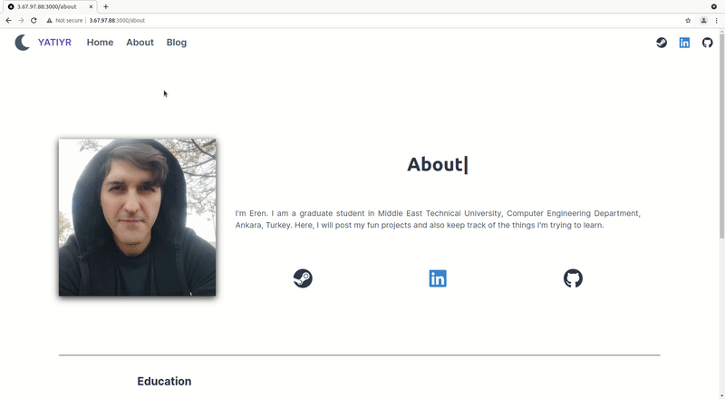

# yatiyr-portfolio

In other project, I was learning how to use api's and connect to databases and fetch data from those places. But I also want to build a customized, modern looking blog website. So here, I also started learning Chakra-UI.

This work is on progress. I will implement functionalities after I finish frontend parts. It will be much easier that way.

## Portfolio App

This project is right now deployed on my instance in aws. It can be seen by navigating to [here](http://3.67.97.88).
Both api and frontend are running on that instance.

I will add a lot of blogs later. Right now, It seems that core functionality of my application has been finished. I can
add and display blogs. I can even render math equations with katex but will try that out later :D.

Here are some gifs of the pages of my portfolio app

| **Home Page** |
|:--:|
||
|  |

| **About Page** |
|:--:|
||
|  |

| **Blog Pages** |
|:--:|
||
|  |